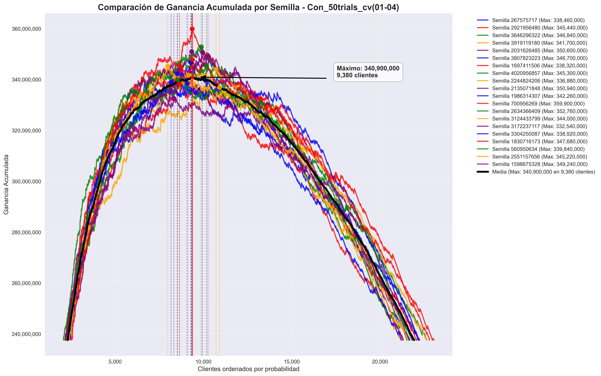
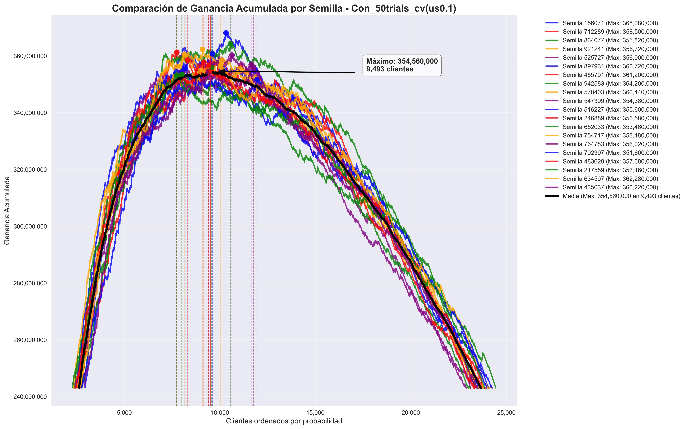
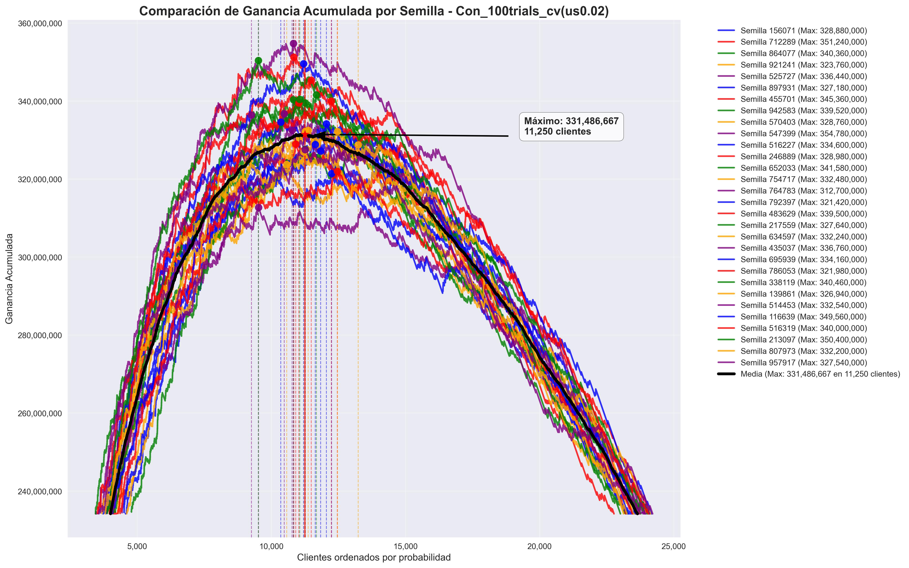

# Comparación de CV

## Bayesiana de 50 iteraciones · Meses 202101 + 202102 + 202103

### Parámetros extendidos

```python
{
    'num_leaves': 278,
    'learning_rate': 0.0371401380258487,
    'feature_fraction': 0.5819071419859364,
    'bagging_fraction': 0.8041169790281475,
    'min_child_samples': 81,
    'max_depth': 15,
    'reg_alpha': 1.6687343874071772,
    'reg_lambda': 1.6858080560719633,
    'bin': 206
}
```

- **Test en 202104**: con 20 semillas
- **Duración**: inicia 08:13 hs · termina 09:18 hs


## Bayesiana de 50 iteraciones · Meses 202101 + 202102 + 202103 + 202104 (extendida)

### Parámetros

```python
{
    'num_leaves': 275, 
    'learning_rate': 0.1124828798037451, 
    'feature_fraction': 0.5350786363389273, 
    'bagging_fraction': 0.8384187556476188, 
    'min_child_samples': 87, 
    'max_depth': 10, 
    'reg_alpha': 1.5885878639015094, 
    'reg_lambda': 5.746900446126809, 
    'bin': 101
}
```

- **Test en 202104**: con 20 semillas

---

## Entrenamiento de 50 iteraciones · Meses 202101 + 202102 + 202103 + 202104

- **Undersampling**: 0,1

- **Test en 202104**: con 20 semillas


```python
Parámetros: {
    'num_leaves': 207, 
    'learning_rate': 0.0347344652162764, 
    'feature_fraction': 0.49155336499144986, 
    'bagging_fraction': 0.5543697079348857, 
    'min_child_samples': 86, 
    'max_depth': 14, 
    'reg_alpha': 0.007675731108071432, 
    'reg_lambda': 2.5345743260625984, 
    'bin': 31, 
    'min_data_in_leaf': 3, 
    'num_iterations': 855}
```

2025-10-09 20:23:31,984 - INFO - src.test_evaluation 57 - Aplicando undersampling (ratio=0.1) en entrenamiento

2025-10-09 21:19:07,233 - INFO - src.grafico_test 346 - Estadísticas comparativas del gráfico:
2025-10-09 21:19:07,233 - INFO - src.grafico_test 347 -   - Ganancia máxima global: 368,080,000
2025-10-09 21:19:07,234 - INFO - src.grafico_test 348 -   - Ganancia máxima promedio: 358,102,000
2025-10-09 21:19:07,234 - INFO - src.grafico_test 349 -   - Desviación estándar de ganancias: 3,902,942
2025-10-09 21:19:07,234 - INFO - src.grafico_test 350 -   - Corte óptimo promedio: 9,566 clientes
2025-10-09 21:19:07,235 - INFO - src.grafico_test 351 -   - Desviación estándar de cortes: 1,284 clientes


2025-10-09 21:19:07,235 - INFO - src.grafico_test 353 -   - CURVA MEDIA: Ganancia máxima: 354,560,000 en 9,493 clientes
2025-10-09 21:19:07,235 - INFO - src.grafico_test 356 -   - Semilla 156071: Max=368,080,000, Corte=10,315
2025-10-09 21:19:07,235 - INFO - src.grafico_test 356 -   - Semilla 712289: Max=358,500,000, Corte=8,314
2025-10-09 21:19:07,235 - INFO - src.grafico_test 356 -   - Semilla 864077: Max=355,820,000, Corte=9,568
2025-10-09 21:19:07,235 - INFO - src.grafico_test 356 -   - Semilla 921241: Max=356,720,000, Corte=10,043
2025-10-09 21:19:07,235 - INFO - src.grafico_test 356 -   - Semilla 525727: Max=356,900,000, Corte=11,634
2025-10-09 21:19:07,235 - INFO - src.grafico_test 356 -   - Semilla 897931: Max=360,720,000, Corte=9,603
2025-10-09 21:19:07,235 - INFO - src.grafico_test 356 -   - Semilla 455701: Max=361,200,000, Corte=7,739
2025-10-09 21:19:07,235 - INFO - src.grafico_test 356 -   - Semilla 942583: Max=364,200,000, Corte=10,549
2025-10-09 21:19:07,235 - INFO - src.grafico_test 356 -   - Semilla 570403: Max=360,440,000, Corte=8,137
2025-10-09 21:19:07,235 - INFO - src.grafico_test 356 -   - Semilla 547399: Max=354,380,000, Corte=9,400
2025-10-09 21:19:07,235 - INFO - src.grafico_test 356 -   - Semilla 516227: Max=355,600,000, Corte=8,179
2025-10-09 21:19:07,235 - INFO - src.grafico_test 356 -   - Semilla 246889: Max=356,580,000, Corte=9,410
2025-10-09 21:19:07,235 - INFO - src.grafico_test 356 -   - Semilla 652033: Max=353,460,000, Corte=8,006
2025-10-09 21:19:07,235 - INFO - src.grafico_test 356 -   - Semilla 754717: Max=358,480,000, Corte=10,115
2025-10-09 21:19:07,235 - INFO - src.grafico_test 356 -   - Semilla 764783: Max=356,020,000, Corte=11,758
2025-10-09 21:19:07,236 - INFO - src.grafico_test 356 -   - Semilla 792397: Max=351,600,000, Corte=11,939
2025-10-09 21:19:07,236 - INFO - src.grafico_test 356 -   - Semilla 483629: Max=357,680,000, Corte=9,155
2025-10-09 21:19:07,236 - INFO - src.grafico_test 356 -   - Semilla 217559: Max=353,160,000, Corte=7,741
2025-10-09 21:19:07,236 - INFO - src.grafico_test 356 -   - Semilla 634597: Max=362,280,000, Corte=9,085
2025-10-09 21:19:07,236 - INFO - src.grafico_test 356 -   - Semilla 435037: Max=360,220,000, Corte=10,628


## Entrenamiento de 50 iteraciones · Meses 202101 + 202102 + 202103 + 202104

- **Undersampling**: 0,02

- **Test en 202104**: con 20 semillas


```python
 📊 Mejores hiperparámetros utilizados: {
    'num_leaves': 249, 
    'learning_rate': 0.16998807802380042, 
    'feature_fraction': 0.5927276564372483, 
    'bagging_fraction': 0.7295321004156294, 
    'min_child_samples': 56, 
    'max_depth': 9, 
    'reg_alpha': 0.32887914288709735, 
    'reg_lambda': 5.933790912101683, 
    'bin': 31, 
    'min_data_in_leaf': 8, 
    'num_iterations': 372}
```
