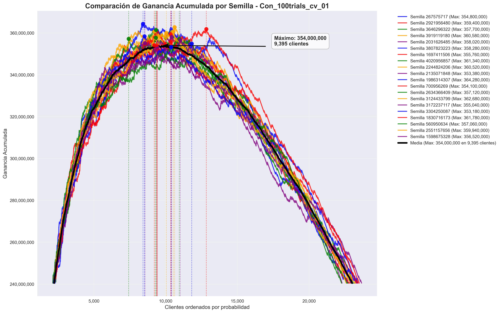

# Comparación de CV

## Bayesiana de 50 iteraciones · Meses 202101 + 202102 + 202103

### Parámetros extendidos

```python
{
    'num_leaves': 278,
    'learning_rate': 0.0371401380258487,
    'feature_fraction': 0.5819071419859364,
    'bagging_fraction': 0.8041169790281475,
    'min_child_samples': 81,
    'max_depth': 15,
    'reg_alpha': 1.6687343874071772,
    'reg_lambda': 1.6858080560719633,
    'bin': 206
}
```

- **Test en 202104**: con 20 semillas
- **Duración**: inicia 08:13 hs · termina 09:18 hs



## Bayesiana de 50 iteraciones · Meses 202101 + 202102 + 202103 + 202104 (extendida)

### Parámetros

```python
{
    'num_leaves': 275, 
    'learning_rate': 0.1124828798037451, 
    'feature_fraction': 0.5350786363389273, 
    'bagging_fraction': 0.8384187556476188, 
    'min_child_samples': 87, 
    'max_depth': 10, 
    'reg_alpha': 1.5885878639015094, 
    'reg_lambda': 5.746900446126809, 
    'bin': 101
}
```

- **Test en 202104**: con 20 semillas

---

## Entrenamiento de 50 iteraciones · Meses 202101 + 202102 + 202103 + 202104

- **Hiperparámetros a optimizar**: num_iterations, learning_rate, feature_fraction, num_leaves, min_data_in_leaf
- **Undersampling**: 0,1
- **Ganancia máxima sin corte (5-fold Cross Validation)**: XXXXXXX
- **Algoritmo**: LightGBM
- **Métrica optimizada**: Ganancia Máxima
- **Hiperparámetros participantes**: num_iterations, learning_rate, feature_fraction, num_leaves, min_data_in_leaf
- **Iteraciones inteligentes de la Bayesian Optimization**: 30
- **Particularidad**: min_data_in_leaf = 3

## Notas adicionales

- **Atributos eliminados**: Ninguno
- **Feature engineering intra-mes**: Ninguno
- **Atributos transformados**: Ninguno
- **Feature engineering histórico**: Lags y DeltaLags de orden 1 y orden 2
- **Variables con prefijo `c` y `m`**: provienen del dataset original
- **Gustavo Denicolay · Clase**: 0 = { CONTINUA }, 1 = { BAJA+1, BAJA+2 }